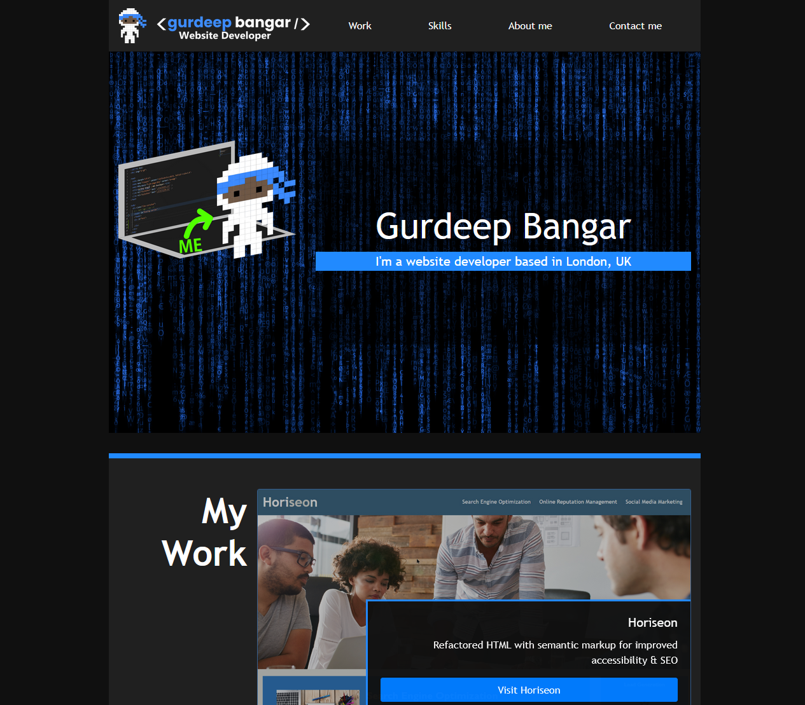

# Challenge - Bootstrap Portfolio Website

## Description

My original vanilla HTML & CSS portfolio ([can be viewed here](https://gurdeep-ninja.github.io/portfolio/)) converted and slightly modified to use BootStrap and it's components such as Nav, Jumbotron & Cards. This version of the portfolio uses as much BootStrap as possible (HTML Structure and special CSS classes for formatting elements).

This portfolio is responsive for mobile, tablet & desktop devices.

[View deployed website on Github Pages](https://gurdeep-ninja.github.io/Bootstrap-Portfolio/)

## Installation

Simply clone or download this project as a zip file & extract to your websites root directory.

## Technologies
 